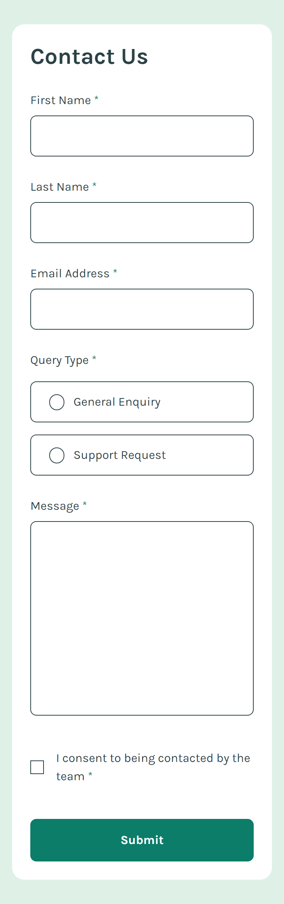
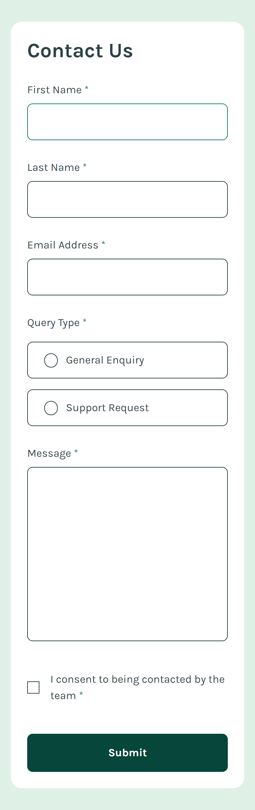
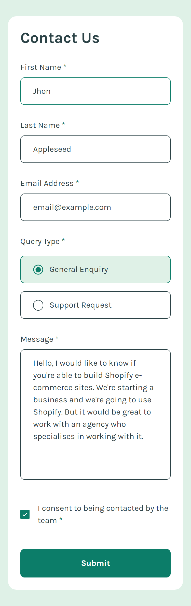
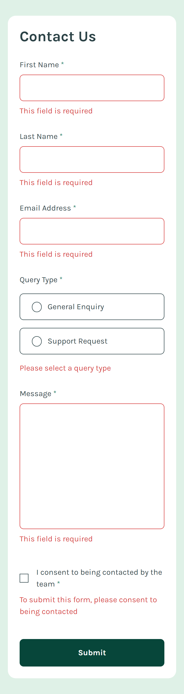
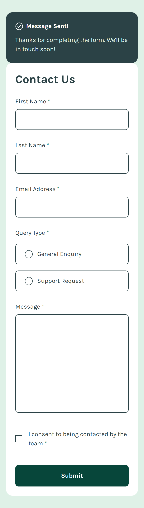
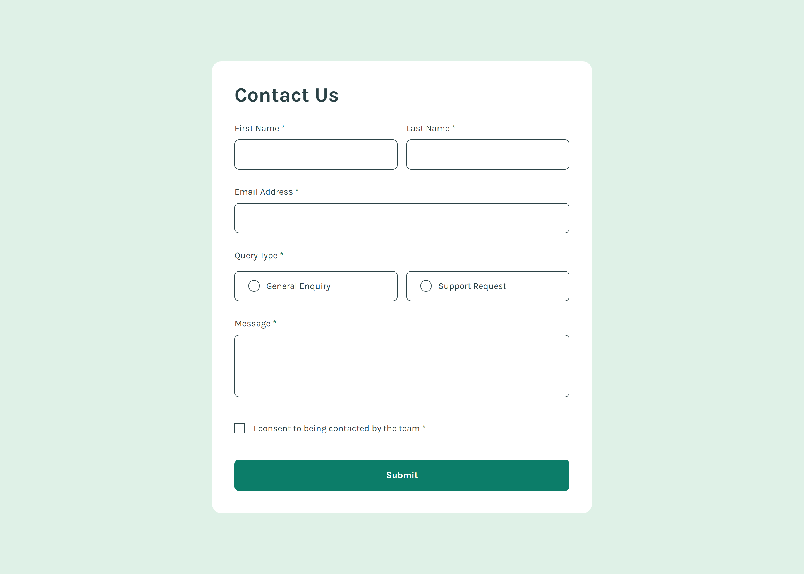
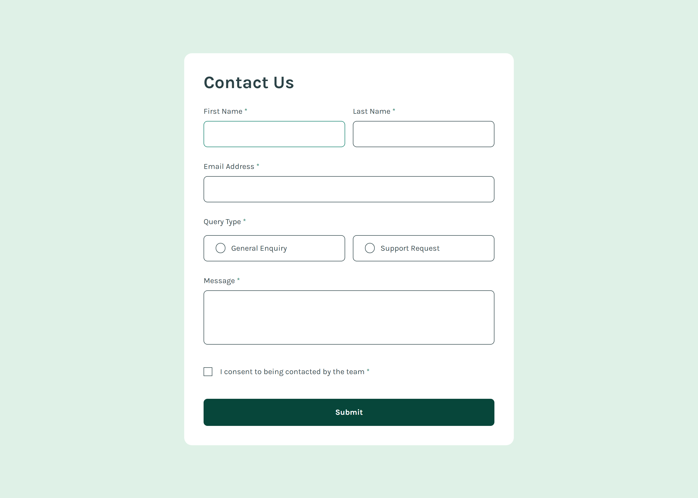
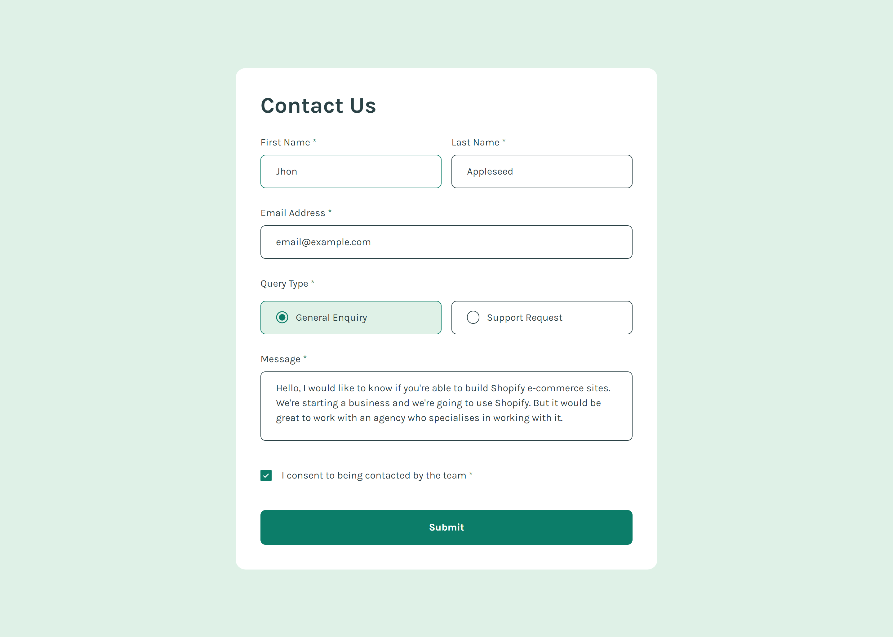
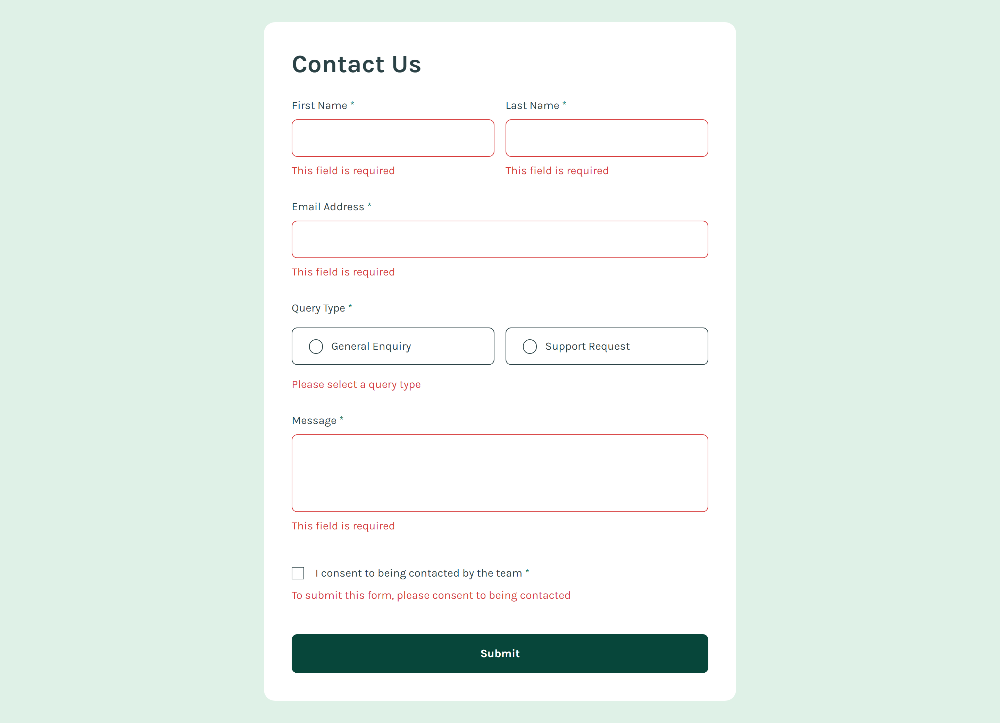
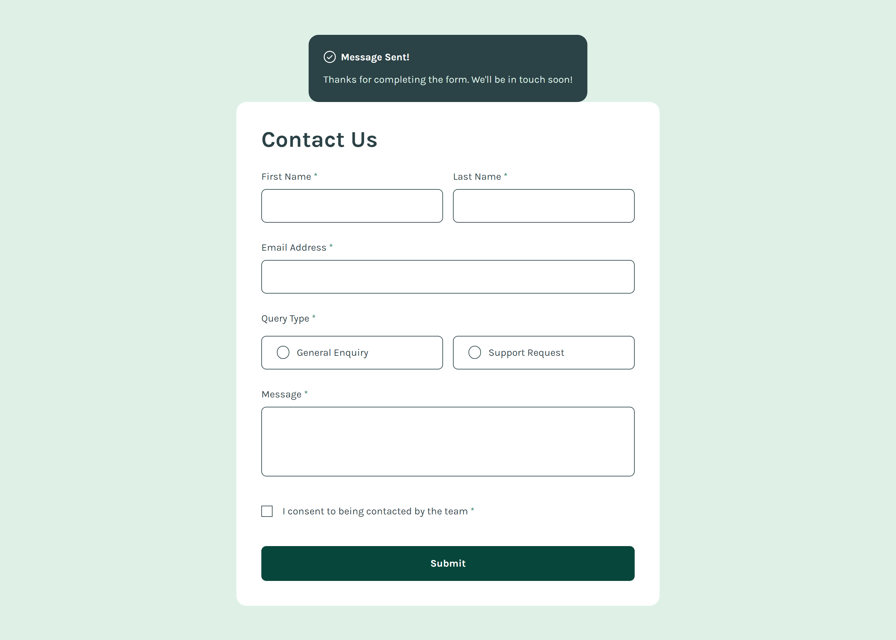

# Frontend Mentor - Contact form solution

This is a solution to the [Contact form challenge on Frontend Mentor](https://www.frontendmentor.io/challenges/contact-form--G-hYlqKJj). Frontend Mentor challenges help you improve your coding skills by building realistic projects.

## Table of contents

- [Overview](#overview)
  - [The challenge](#the-challenge)
  - [Screenshot](#screenshot)
  - [Links](#links)
- [My process](#my-process)
  - [Built with](#built-with)
  - [What I learned](#what-i-learned)
  - [Continued development](#continued-development)
- [Author](#author)

## Overview

The challenge is to build out a Contact Form. This challenge is part of a roadmap that I have defined called **Modern Styling**. it's purpose is to get familiar with the modern styling tools used by developers to enhance development time and ease of styling.

### The challenge

Users should be able to:

- Complete the form and see a success toast message upon successful submission **(DONE)**
- Receive form validation messages if:
  - A required field has been missed **(DONE)**
  - The email address is not formatted correctly **(DONE)**
- Complete the form only using their keyboard **(DONE)**
- Have inputs, error messages, and the success message announced on their screen reader **(DONE)**
- View the optimal layout for the interface depending on their device's screen size **(DONE)**
- See hover and focus states for all interactive elements on the page **(DONE)**

### Screenshot

#### Mobile

##### Initial View

##### Hover View

##### Active View

##### Error View

##### Success View

#### Desktop

##### Initial View

##### Hover View

##### Active View

##### Error View

##### Success View

### Links

- Solution URL: [Solution URL](https://www.frontendmentor.io/solutions/contact-form-TvMrA_FOwW)
- Live Site URL: [Live Site URL](https://frontendmentor-ilyesab.github.io/contact-form/)

## My process

### Built with

- Semantic HTML5 markup
- CSS custom properties
- Flexbox
- CSS Grid
- Mobile-first workflow
- [React](https://reactjs.org/) - JS library
- [Next.js](https://nextjs.org/) - React framework
- [TypeScript](https://www.typescriptlang.org/) - Type Checking Language Built on top of Javascript.
- [TailwindCSS](https://tailwindcss.com/) - A utility-first CSS framework

### What I learned

The goal of this project for me was to practice **TailwindCSS** which is a utility CSS framework. which means all styling is done using pre built classes for you. tailwind offers a wide range of these classes so you can style elements however you want. It's also very efficient it only generates CSS for the classes you use. and it's easily customizable.

I customized the tailwind config with the color palette of the project. which made the colors available on all tailwind utility color classes. at first it was hard to style as I had to lookup a lot in the docs of tailwind. but after finishing the project. I can see why it's popular among developers.

It's very fast to style once you have a little experience working with it. and you don't have to think about how to structure your CSS. the styling just sits with the markup in one place.

Even though this project seemed to focus on accessability this is a topic on which I lack a lot of knowledge.

I tried to make the error message and the success message be announced to screen readers using the `aria-live` and `aria-atomic` properties but I haven't tested using a screen reader.

I could also complete the form using keyboard only.

For previous projects I was using **Vite** as my bundler. but even though this is fully client app. I tried to use **NextJS** as practice.

### Continued development

I'd like to make more projects using **TailwindCSS** and **NextJS**. after that I'm thinking about checking out UI libraries.

## Author

- Frontend Mentor - [@ilyesab](https://www.frontendmentor.io/profile/ilyesab)
